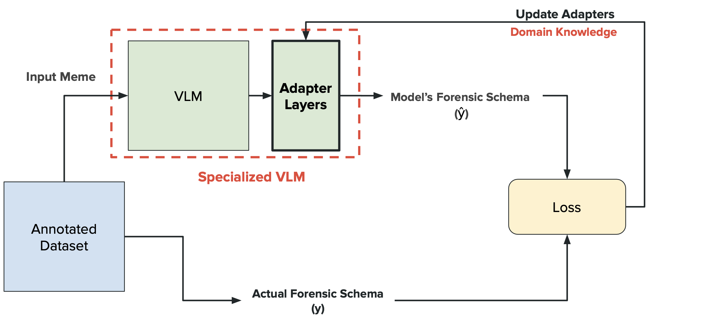

# Stage 1: Supervised Fine-Tuning (SFT)

## Structural Domain Adaptation
The first stage of the transfer learning pipeline focuses on adapting the base model to the specific forensic schema without losing its general world knowledge.

<p align="center">
  
</p>

## LoRA Configuration & Hyperparameters
Based on the execution parameters, the training environment is configured as follows:
* **Method:** Low-Rank Adaptation (LoRA).
* **Rank & Alpha:** $r=32$, $\alpha=32$.
* **Target Modules:** Full-Linear Tuning (applied across all linear layers).
* **Precision & Memory:** `bfloat16` precision with gradient checkpointing enabled to optimize VRAM footprint.
* **Optimization Parameters:**
  * **Epochs:** 5
  * **Learning Rate:** $2 \times 10^{-5}$
  * **Batch Scaling:** Per-device batch size of 1 with 16 gradient accumulation steps.
* **Weight Management:** While the LoRA adapters are actively updated to map the forensic schema, explicit freezing of the Vision Transformer (`freeze_vit: false`) and the cross-modal aligner (`freeze_aligner: false`) was bypassed in this configuration to allow deeper structural adaptation during the training steps.

## Execution Script
The fine-tuning process is executed utilizing the `swift sft` framework with the following exact configuration:

```bash
swift sft \
    --model /content/internvl2_5_8b \
    --model_type internvl2_5 \
    --dataset train_split.jsonl \
    --val_dataset test_split.jsonl \
    --tuner_type lora \
    --torch_dtype bfloat16 \
    --attn_impl eager \
    --device_map auto \
    --output_dir output_meme_expert_final \
    --num_train_epochs 5 \
    --per_device_train_batch_size 1 \
    --gradient_accumulation_steps 16 \
    --learning_rate 2e-5 \
    --lora_rank 32 \
    --lora_alpha 32 \
    --target_modules all-linear \
    --freeze_vit false \
    --freeze_aligner false \
    --acc_strategy seq \
    --gradient_checkpointing true \
    --eval_steps 50 \
    --save_steps 50 \
    --save_total_limit 2 \
    --load_best_model_at_end true \
    --metric_for_best_model loss
