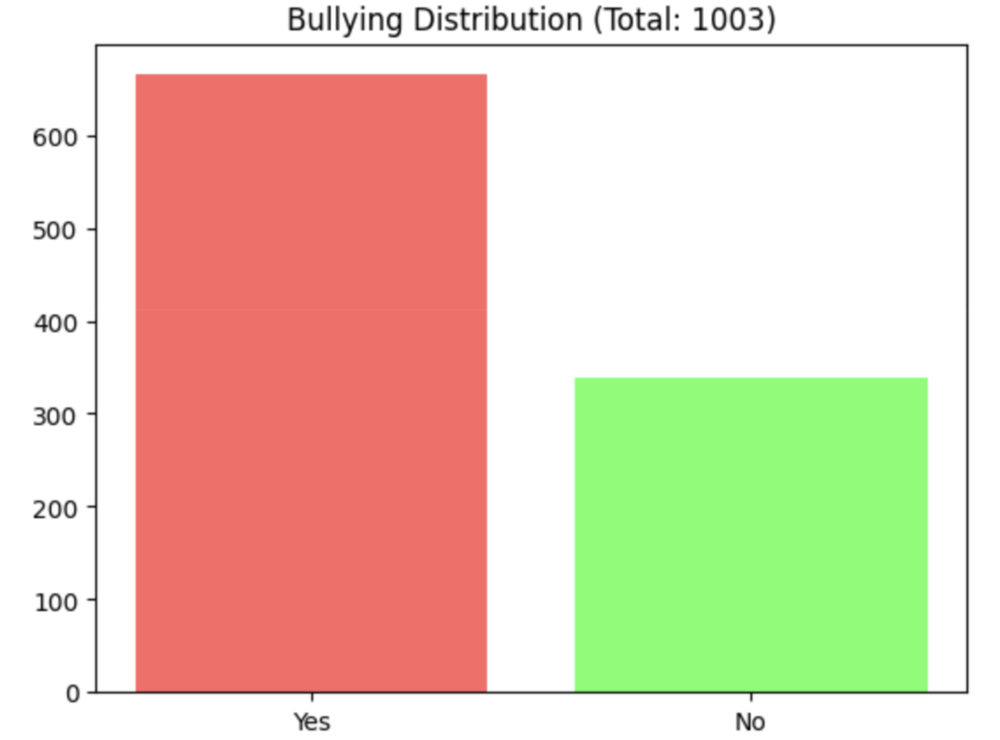
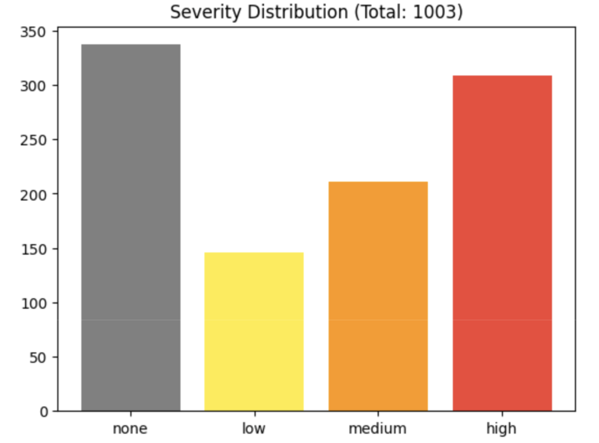
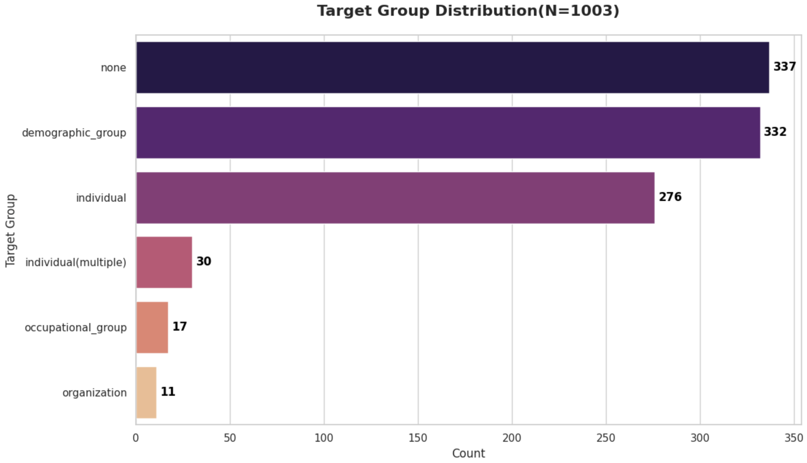
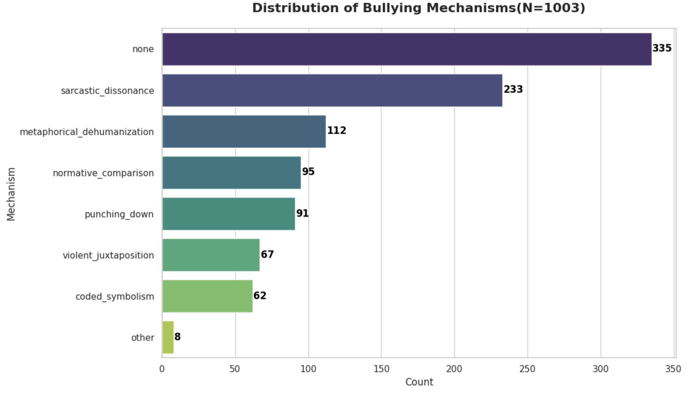
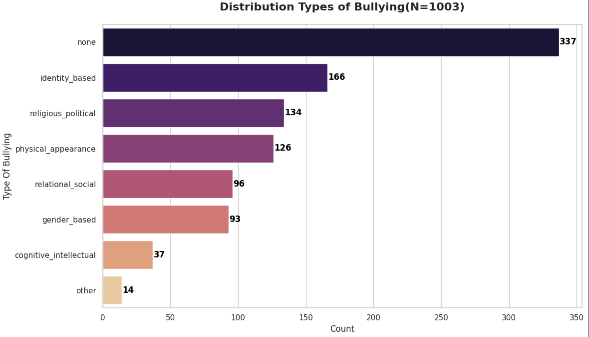
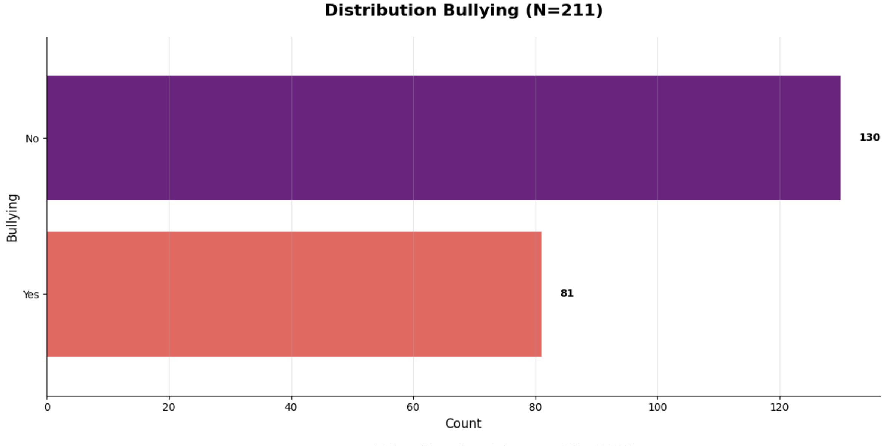
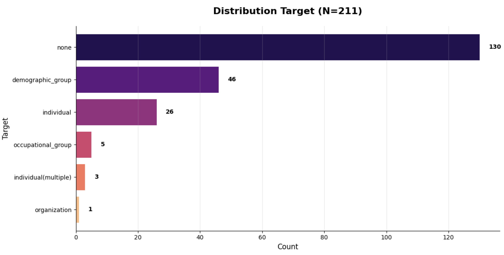
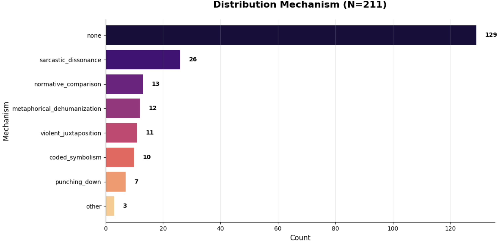
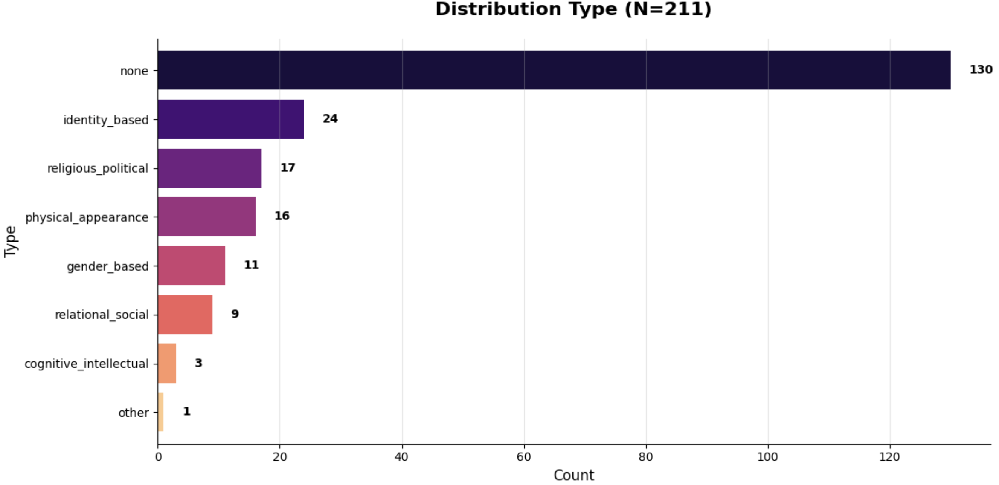

# Dataset

This directory documents the datasets used for training and evaluating the **Multimodal Cyberbullying Detection** framework.

> **Note**
>
> The complete datasets are **not publicly released** due to copyright, ethical, and privacy considerations. Many samples consist of real-world memes collected from publicly available online platforms that contain potentially harmful or offensive content.

---

# Dataset Overview

| Dataset | Purpose | Samples |
|---------|---------|---------:|
| **SFT Dataset** | Supervised Fine-Tuning | **1,003** |
| **DPO Dataset** | Direct Preference Optimization | **210** |
| **Evaluation Dataset** | Final Performance Evaluation | **201** |

---

# SFT Dataset Distribution

  

The SFT dataset contains **1,003** manually curated multimodal meme samples.

| Label | Samples |
|-------|---------:|
| **Bullying** | **663** |
| **Non-Bullying** | **340** |

The dataset intentionally contains a larger number of bullying samples to expose the model to diverse implicit bullying mechanisms while still retaining sufficient benign examples for learning robust decision boundaries.

---

# Severity Distribution

  

---

# Target Group Distribution

  

---

# Bullying Mechanism Distribution

  

---

# Bullying Type Distribution

  

---

# Dataset Characteristics

Unlike conventional cyberbullying datasets that focus on explicit offensive language, this dataset emphasizes **implicit multimodal cyberbullying**, where harmful intent arises only through the interaction of visual and textual modalities.

Examples include:

- Sarcastic dissonance
- Coded symbolism
- Metaphorical dehumanization
- Violent juxtaposition
- Punching down
- Identity-based harassment
- Gender-based harassment
- Religious and political targeting
- Cultural and meme-specific references

Both harmful and benign memes are included to reduce censorship bias and improve the model's ability to distinguish between satire and genuine harassment.

---

# Annotation Schema

Each sample follows a structured forensic annotation schema.

## Analysis Fields

| Field | Description |
|-------|-------------|
| `visual_cues` | Important visual evidence contributing to the decision |
| `text_cues` | Important textual evidence extracted from the meme |
| `interpretation` | Joint reasoning explaining how the image and text interact |
| `confidence` | Confidence score for the generated reasoning |

---

## Label Fields

| Field | Description |
|-------|-------------|
| `bullying` | Yes / No |
| `target` | Individual, demographic group, organization, etc. |
| `mechanism` | Bullying mechanism employed |
| `type` | Category of cyberbullying |
| `severity` | None, Low, Medium, or High |

---

# DPO Dataset

The DPO dataset contains **210** carefully curated preference pairs used for **Direct Preference Optimization (DPO)**.

Each sample consists of:

- Input prompt
- Preferred (chosen) response
- Rejected response

The preference pairs were designed to improve the model's ability to:

- Resolve boundary ambiguity
- Reduce the **Hallucination of Harmlessness**
- Improve multimodal reasoning
- Differentiate satire from implicit harassment
- Reduce false negatives

---

## DPO Data Distribution

  

---

## DPO Target Distribution

  

---

## DPO Mechanism Distribution

  

---

## DPO Type Distribution

  

---

# Evaluation Dataset

The evaluation dataset contains **201** unseen multimodal meme samples used exclusively for final testing.

Performance on this dataset:

| Metric | Value |
|---------|-------:|
| **Accuracy** | **80.60%** |
| **Macro F1** | **0.79** |
| **Weighted F1** | **0.81** |

---

